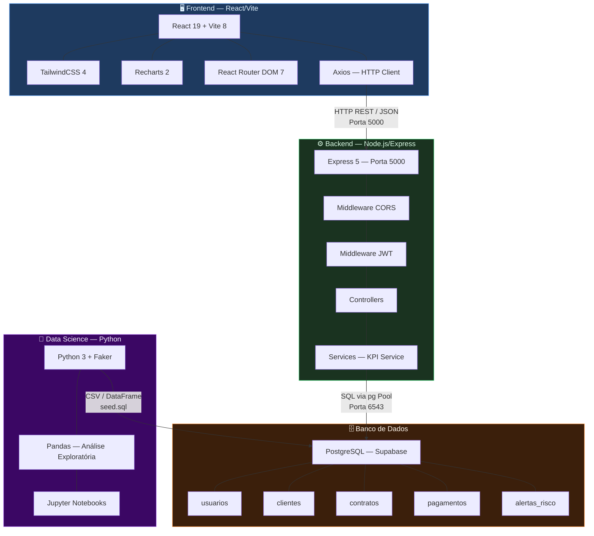
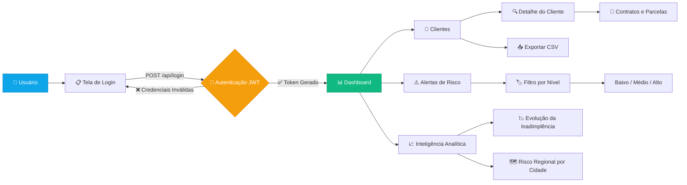
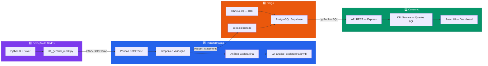
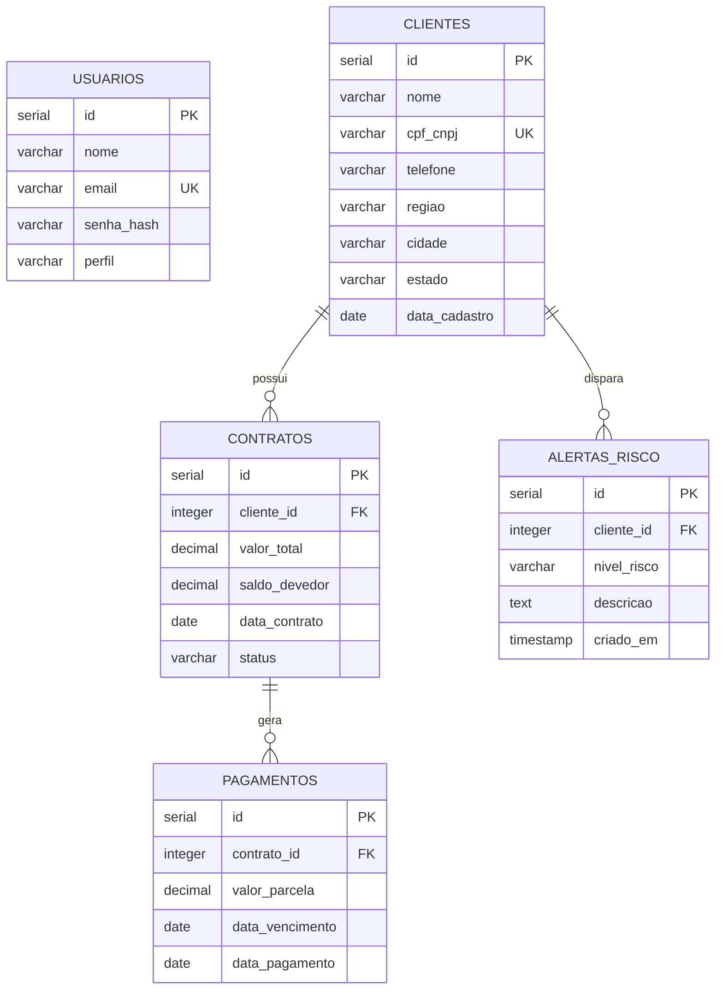
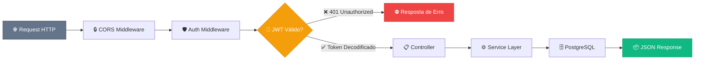
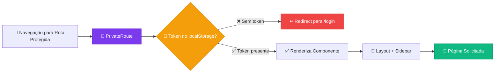
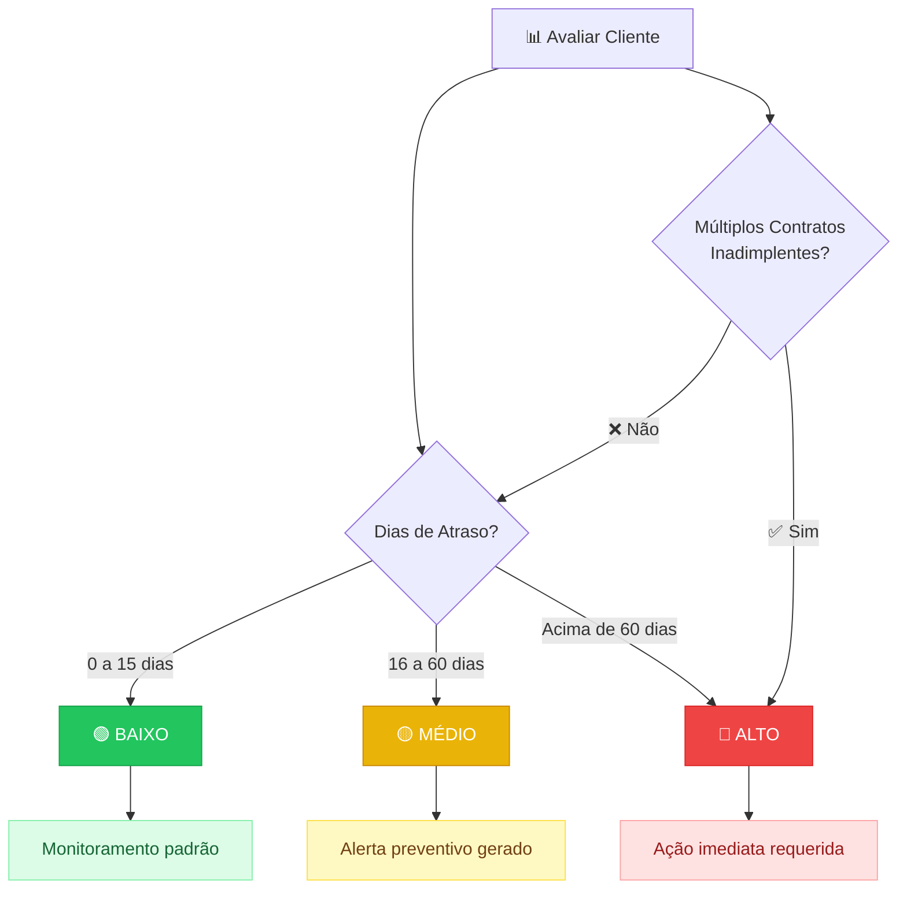

# 🏗️ Arquitetura do Sistema — CreditGuard AI

> Documento de Arquitetura Técnica  
> Versão 1.0 · Maio 2026

---

## Sumário

1. [Diagrama de Arquitetura do Sistema](#1-diagrama-de-arquitetura-do-sistema)
2. [Fluxo do Sistema — User Flow](#2-fluxo-do-sistema--user-flow)
3. [Fluxo ETL — Pipeline de Dados](#3-fluxo-etl--pipeline-de-dados)
4. [Modelo Lógico — Diagrama ER](#4-modelo-lógico--diagrama-er)
5. [Segurança e Governança](#5-segurança-e-governança)
6. [Classificação de Risco — Heurísticas](#6-classificação-de-risco--heurísticas)

---

## 1. Diagrama de Arquitetura do Sistema

Visão macro dos quatro pilares tecnológicos e seus protocolos de comunicação.



### Resumo das Comunicações

| Origem | Destino | Protocolo | Detalhe |
|--------|---------|-----------|---------|
| Frontend | Backend | HTTP REST / JSON | Axios → Express na porta 5000 |
| Backend | PostgreSQL | SQL / TCP | pg Pool → Supabase na porta 6543 |
| Data Science | PostgreSQL | SQL / Seed | Faker gera CSV → seed.sql → PostgreSQL |

---

## 2. Fluxo do Sistema — User Flow

Jornada completa do usuário dentro da plataforma, desde o login até a exportação de dados.



### Páginas e Rotas do Frontend

| Rota | Componente | Descrição | Autenticação |
|------|-----------|-----------|:------------:|
| `/login` | `Login.jsx` | Tela de autenticação | ❌ Pública |
| `/` | `Dashboard.jsx` | Painel principal com KPIs e gráficos | ✅ JWT |
| `/clientes` | `Clientes.jsx` | Lista paginada de clientes | ✅ JWT |
| `/clientes/:id` | `ClienteDetail.jsx` | Ficha completa do cliente | ✅ JWT |
| `/alertas` | `Alertas.jsx` | Central de alertas de risco | ✅ JWT |

---

## 3. Fluxo ETL — Pipeline de Dados

Pipeline completo desde a geração sintética de dados até a visualização no painel React.



### Detalhamento das Etapas

| Etapa | Ferramenta | Artefato Produzido | Localização |
|-------|-----------|-------------------|-------------|
| Geração | Python + Faker | Dados sintéticos realistas | `data-science/notebooks/01_gerador_mock.py` |
| Análise | Pandas + Jupyter | Relatório exploratório | `data-science/notebooks/02_analise_exploratoria.ipynb` |
| Esquema DDL | SQL | Estrutura das 5 tabelas | `database/schema.sql` |
| Carga Seed | SQL | ~350KB de dados mock | `database/seed.sql` |
| API REST | Express + pg | Endpoints JSON | `backend/src/` |
| Visualização | React + Recharts | Dashboard interativo | `frontend/src/` |

---

## 4. Modelo Lógico — Diagrama ER

Modelo entidade-relacionamento completo com as cinco tabelas do sistema e seus relacionamentos.



### Dicionário de Dados

#### Tabela `usuarios`
| Coluna | Tipo | Restrições | Descrição |
|--------|------|-----------|-----------|
| `id` | `SERIAL` | PK | Identificador único |
| `nome` | `VARCHAR(100)` | NOT NULL | Nome completo do operador |
| `email` | `VARCHAR(100)` | UNIQUE, NOT NULL | Email para login |
| `senha_hash` | `VARCHAR(255)` | NOT NULL | Hash bcrypt da senha |
| `perfil` | `VARCHAR(20)` | DEFAULT 'analista' | Papel no sistema |

#### Tabela `clientes`
| Coluna | Tipo | Restrições | Descrição |
|--------|------|-----------|-----------|
| `id` | `SERIAL` | PK | Identificador único |
| `nome` | `VARCHAR(150)` | NOT NULL | Nome ou razão social |
| `cpf_cnpj` | `VARCHAR(20)` | UNIQUE, NOT NULL | Documento fiscal |
| `telefone` | `VARCHAR(20)` | — | Contato telefônico |
| `regiao` | `VARCHAR(50)` | — | Região geográfica |
| `cidade` | `VARCHAR(100)` | — | Cidade do cliente |
| `estado` | `VARCHAR(2)` | — | UF do cliente |
| `data_cadastro` | `DATE` | DEFAULT CURRENT_DATE | Data de inclusão |

#### Tabela `contratos`
| Coluna | Tipo | Restrições | Descrição |
|--------|------|-----------|-----------|
| `id` | `SERIAL` | PK | Identificador único |
| `cliente_id` | `INTEGER` | FK → clientes | Referência ao cliente |
| `valor_total` | `DECIMAL(12,2)` | NOT NULL | Valor original do contrato |
| `saldo_devedor` | `DECIMAL(12,2)` | NOT NULL | Saldo remanescente |
| `data_contrato` | `DATE` | NOT NULL | Data de assinatura |
| `status` | `VARCHAR(20)` | DEFAULT 'ativo' | ativo / quitado / inadimplente |

#### Tabela `pagamentos`
| Coluna | Tipo | Restrições | Descrição |
|--------|------|-----------|-----------|
| `id` | `SERIAL` | PK | Identificador único |
| `contrato_id` | `INTEGER` | FK → contratos | Referência ao contrato |
| `valor_parcela` | `DECIMAL(12,2)` | NOT NULL | Valor da parcela |
| `data_vencimento` | `DATE` | NOT NULL | Data de vencimento |
| `data_pagamento` | `DATE` | NULLABLE | Data efetiva do pagamento |

> **Regra de negócio:** Se `data_pagamento IS NULL` e `data_vencimento < CURRENT_DATE`, a parcela é considerada **em atraso**.

#### Tabela `alertas_risco`
| Coluna | Tipo | Restrições | Descrição |
|--------|------|-----------|-----------|
| `id` | `SERIAL` | PK | Identificador único |
| `cliente_id` | `INTEGER` | FK → clientes | Referência ao cliente |
| `nivel_risco` | `VARCHAR(20)` | — | Baixo / Medio / Alto |
| `descricao` | `TEXT` | — | Descrição narrativa do risco |
| `criado_em` | `TIMESTAMP` | DEFAULT CURRENT_TIMESTAMP | Data/hora de criação |

---

## 5. Segurança e Governança

### 5.1 Pipeline de Segurança no Backend

Fluxo completo de uma requisição autenticada, do recebimento até a resposta.



### 5.2 Proteção de Rotas no Frontend

Mecanismo de guarda de rotas utilizando `PrivateRoute` com verificação de token no `localStorage`.



### 5.3 Detalhamento Técnico da Segurança

| Camada | Tecnologia | Detalhamento |
|--------|-----------|-------------|
| **CORS** | `cors` middleware | Permite requisições cross-origin do frontend |
| **Autenticação** | `jsonwebtoken` | Tokens JWT com expiração de 8 horas |
| **Hashing** | `bcrypt` | Hash de senhas com salt rounds |
| **Transporte** | HTTPS / Supabase | Conexão cifrada com o banco na nuvem |
| **Variáveis** | `dotenv` | Segredos isolados em `.env` fora do controle de versão |
| **Frontend Guard** | `PrivateRoute` | HOC que valida presença do token antes de renderizar |

### 5.4 Estrutura do Token JWT

```json
{
  "header": {
    "alg": "HS256",
    "typ": "JWT"
  },
  "payload": {
    "id": 1,
    "perfil": "analista",
    "iat": 1748200000,
    "exp": 1748228800
  }
}
```

---

## 6. Classificação de Risco — Heurísticas

### Regras de Classificação

O sistema classifica os clientes em três níveis de risco com base no histórico de pagamentos e atrasos.



### Tabela de Critérios

| Nível | Ícone | Critério | Ação do Sistema |
|-------|:-----:|----------|----------------|
| **Baixo** | 🟢 | Atraso ≤ 15 dias | Monitoramento padrão — sem alerta |
| **Médio** | 🟡 | Atraso entre 16 e 60 dias | Alerta preventivo gerado automaticamente |
| **Alto** | 🔴 | Atraso > 60 dias **OU** múltiplos contratos inadimplentes | Ação imediata — cliente marcado como crítico |

### Implementação no Backend

A identificação de clientes críticos é realizada pela query no `kpiService.js`:

```sql
-- Clientes com atraso superior a 60 dias (Risco Alto)
SELECT DISTINCT c.* 
FROM clientes c
JOIN contratos ct ON c.id = ct.cliente_id
JOIN pagamentos p ON ct.id = p.contrato_id
WHERE p.data_pagamento IS NULL 
  AND CURRENT_DATE - p.data_vencimento > 60;
```

### Métricas Calculadas (KPIs)

| KPI | Cálculo | Descrição |
|-----|---------|-----------|
| **Inadimplência Total** | `SUM(valor_parcela)` onde `data_pagamento IS NULL` e vencida | Soma de todas as parcelas em atraso |
| **Recuperação do Mês** | `SUM(valor_parcela)` onde `data_pagamento > data_vencimento` no mês atual | Parcelas pagas com atraso neste mês |
| **Atraso Médio** | `AVG(CURRENT_DATE - data_vencimento)` das parcelas vencidas | Média de dias de atraso |
| **Clientes Críticos** | `COUNT(DISTINCT cliente_id)` na tabela de alertas | Total de clientes com alertas ativos |

---

> **Documento gerado em:** Maio 2026  
> **Projeto:** CreditGuard AI — Plataforma Analítica de Recuperação de Crédito  
> **Disciplina:** Projeto Universitário — Semanas 2 e 3
