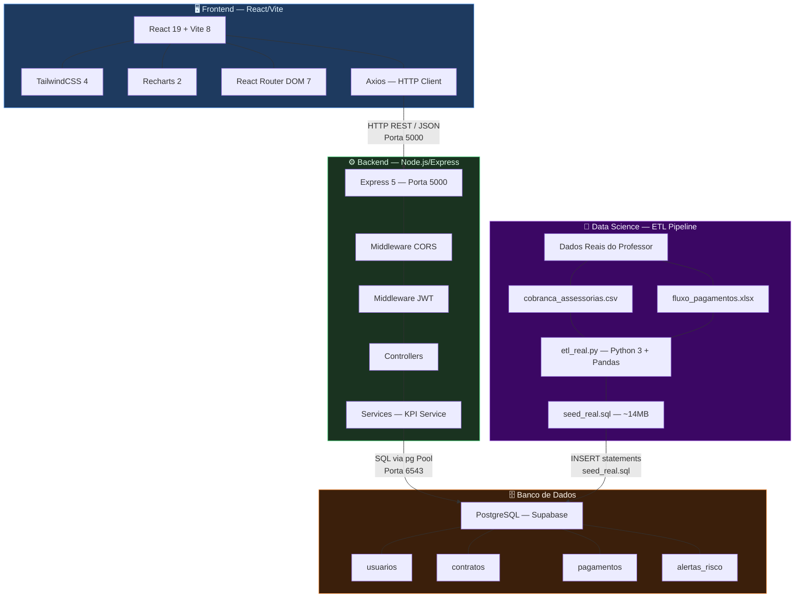
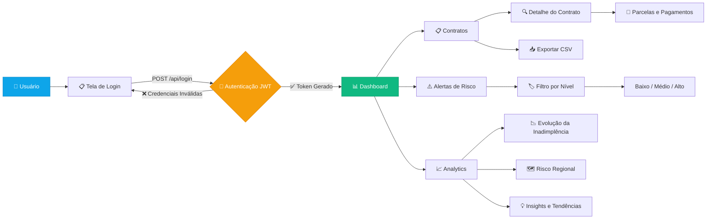
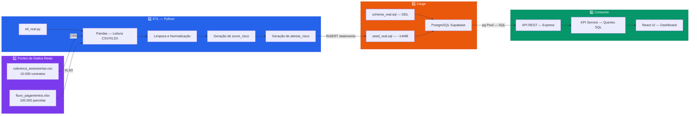
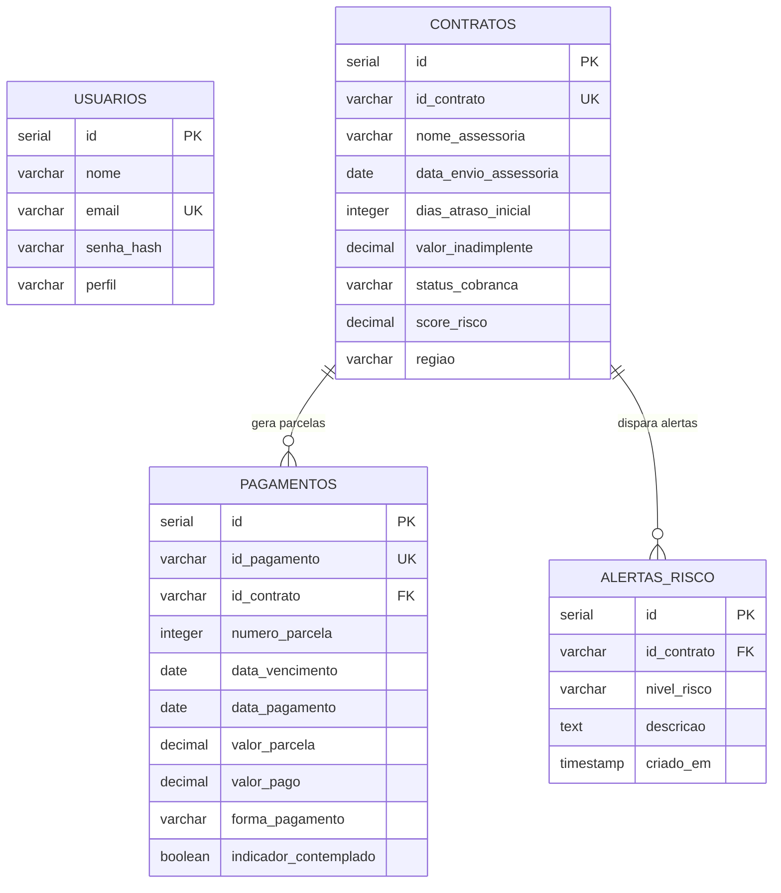
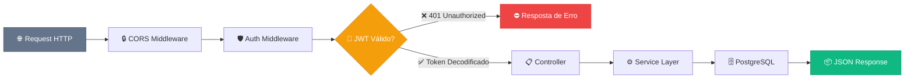
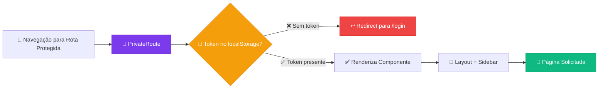
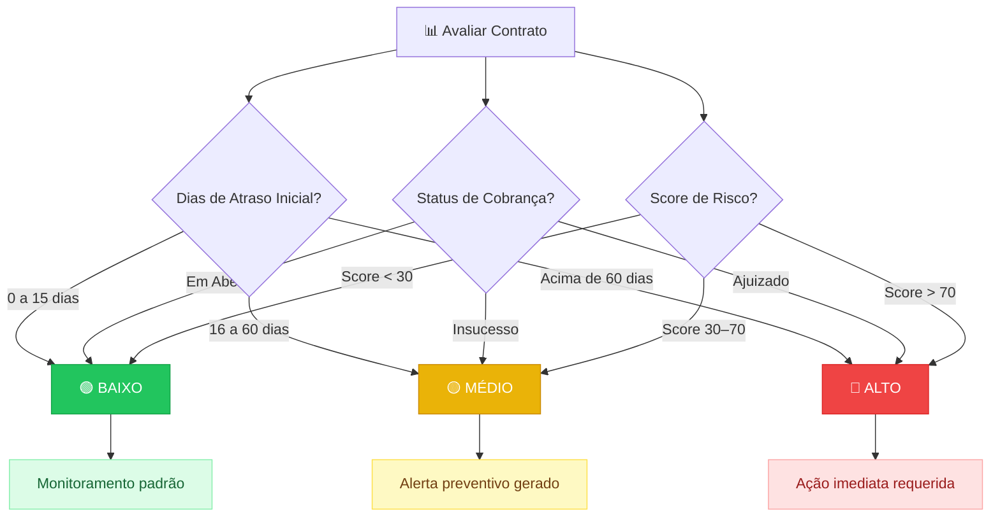

# 🏗️ Arquitetura do Sistema — CreditGuard AI

> Documento de Arquitetura Técnica  
> Versão 2.0 · Maio 2026

---

## Sumário

1. [Diagrama de Arquitetura do Sistema](#1-diagrama-de-arquitetura-do-sistema)
2. [Fluxo do Sistema — User Flow](#2-fluxo-do-sistema--user-flow)
3. [Fluxo ETL — Pipeline de Dados](#3-fluxo-etl--pipeline-de-dados)
4. [Modelo Lógico — Diagrama ER](#4-modelo-lógico--diagrama-er)
5. [Segurança e Governança](#5-segurança-e-governança)
6. [Classificação de Risco — Heurísticas](#6-classificação-de-risco--heurísticas)

---

## 1. Diagrama de Arquitetura do Sistema

Visão macro dos quatro pilares tecnológicos e seus protocolos de comunicação. O pipeline de dados agora parte de **datasets reais** fornecidos pelo professor, processados por um script ETL em Python.



### Resumo das Comunicações

| Origem | Destino | Protocolo | Detalhe |
|--------|---------|-----------|---------|
| Frontend | Backend | HTTP REST / JSON | Axios → Express na porta 5000 |
| Backend | PostgreSQL | SQL / TCP | pg Pool → Supabase na porta 6543 |
| ETL Python | PostgreSQL | SQL / Seed | CSV/XLSX → etl_real.py → seed_real.sql → PostgreSQL |

---

## 2. Fluxo do Sistema — User Flow

Jornada completa do usuário dentro da plataforma, desde o login até a exportação de dados.



### Páginas e Rotas do Frontend

| Rota | Componente | Descrição | Autenticação |
|------|-----------|-----------|:------------:|
| `/login` | `Login.jsx` | Tela de autenticação | ❌ Pública |
| `/` | `Dashboard.jsx` | Painel principal com KPIs e gráficos | ✅ JWT |
| `/clientes` | `Clientes.jsx` | Lista paginada de contratos com filtros | ✅ JWT |
| `/clientes/:id` | `ClienteDetail.jsx` | Ficha completa do contrato com parcelas | ✅ JWT |
| `/alertas` | `Alertas.jsx` | Central de alertas de risco | ✅ JWT |
| `/analytics` | `Analytics.jsx` | Inteligência analítica e tendências | ✅ JWT |

---

## 3. Fluxo ETL — Pipeline de Dados

Pipeline completo desde os **dados reais** fornecidos pelo professor até a visualização no painel React. Os dados sintéticos foram substituídos por dois datasets de produção.



### Detalhamento das Etapas

| Etapa | Ferramenta | Artefato Produzido | Localização |
|-------|-----------|-------------------|-------------|
| Fonte — Contratos | CSV do professor | 10.000 contratos de assessorias | `data-science/cobranca_assessorias.csv` |
| Fonte — Pagamentos | XLSX do professor | 100.000 parcelas de pagamento | `data-science/fluxo_pagamentos.xlsx` |
| ETL | Python 3 + Pandas | Transformação, score e alertas | `data-science/etl_real.py` |
| Esquema DDL | SQL | Estrutura das 4 tabelas | `database/schema_real.sql` |
| Carga Seed | SQL | ~14MB de dados reais | `database/seed_real.sql` |
| API REST | Express + pg | Endpoints JSON | `backend/src/` |
| Visualização | React + Recharts | Dashboard interativo | `frontend/src/` |

### Dados de Origem

| Dataset | Formato | Volume | Conteúdo |
|---------|---------|--------|----------|
| `cobranca_assessorias.csv` | CSV | 10.000 registros | Contratos enviados para assessorias de cobrança |
| `fluxo_pagamentos.xlsx` | XLSX | 100.000 registros | Fluxo de parcelas e pagamentos realizados |

### Assessorias de Cobrança

O sistema recebe dados de **4 assessorias** de cobrança que operam em **5 regiões** do Brasil:

| Regiões |
|---------|
| Nordeste |
| Sudeste |
| Sul |
| Norte |
| Centro-Oeste |

---

## 4. Modelo Lógico — Diagrama ER

Modelo entidade-relacionamento com as **quatro tabelas** do sistema e seus relacionamentos. A tabela `clientes` foi eliminada — o contrato é agora a entidade central, referenciado diretamente pelas demais tabelas.



### Dicionário de Dados

#### Tabela `usuarios`
| Coluna | Tipo | Restrições | Descrição |
|--------|------|-----------|-----------| 
| `id` | `SERIAL` | PK | Identificador único |
| `nome` | `VARCHAR(100)` | NOT NULL | Nome completo do operador |
| `email` | `VARCHAR(100)` | UNIQUE, NOT NULL | Email para login |
| `senha_hash` | `VARCHAR(255)` | NOT NULL | Hash bcrypt da senha |
| `perfil` | `VARCHAR(20)` | DEFAULT 'analista' | Papel no sistema |

#### Tabela `contratos`
| Coluna | Tipo | Restrições | Descrição |
|--------|------|-----------|-----------| 
| `id` | `SERIAL` | PK | Identificador sequencial |
| `id_contrato` | `VARCHAR(20)` | UNIQUE, NOT NULL | Código do contrato (CONTR_2026_XXXXX) |
| `nome_assessoria` | `VARCHAR(150)` | — | Assessoria de cobrança responsável |
| `data_envio_assessoria` | `DATE` | — | Data de envio para a assessoria |
| `dias_atraso_inicial` | `INTEGER` | DEFAULT 0 | Dias de atraso na entrada |
| `valor_inadimplente` | `DECIMAL(12,2)` | DEFAULT 0 | Valor total inadimplente |
| `status_cobranca` | `VARCHAR(30)` | — | Em Aberto / Acordo Firmado / Insucesso / Ajuizado |
| `score_risco` | `DECIMAL(5,2)` | — | Score de risco calculado (0–100) |
| `regiao` | `VARCHAR(50)` | — | Região geográfica (Nordeste, Sudeste, Sul, Norte, Centro-Oeste) |

#### Tabela `pagamentos`
| Coluna | Tipo | Restrições | Descrição |
|--------|------|-----------|-----------| 
| `id` | `SERIAL` | PK | Identificador sequencial |
| `id_pagamento` | `VARCHAR(20)` | UNIQUE, NOT NULL | Código do pagamento (PAG_XXXXXXX) |
| `id_contrato` | `VARCHAR(20)` | FK → contratos(id_contrato) | Referência ao contrato |
| `numero_parcela` | `INTEGER` | — | Número sequencial da parcela |
| `data_vencimento` | `DATE` | NOT NULL | Data de vencimento da parcela |
| `data_pagamento` | `DATE` | NULLABLE | Data efetiva do pagamento |
| `valor_parcela` | `DECIMAL(12,2)` | NOT NULL | Valor nominal da parcela |
| `valor_pago` | `DECIMAL(12,2)` | DEFAULT 0 | Valor efetivamente pago |
| `forma_pagamento` | `VARCHAR(30)` | — | Boleto / Pix / Débito Automático |
| `indicador_contemplado` | `BOOLEAN` | DEFAULT FALSE | Se a parcela foi contemplada |

> **Regra de negócio:** Se `data_pagamento IS NULL` e `data_vencimento < CURRENT_DATE`, a parcela é considerada **em atraso**.

#### Tabela `alertas_risco`
| Coluna | Tipo | Restrições | Descrição |
|--------|------|-----------|-----------| 
| `id` | `SERIAL` | PK | Identificador único |
| `id_contrato` | `VARCHAR(20)` | FK → contratos(id_contrato) | Referência ao contrato |
| `nivel_risco` | `VARCHAR(20)` | — | Baixo / Medio / Alto |
| `descricao` | `TEXT` | — | Descrição narrativa do risco |
| `criado_em` | `TIMESTAMP` | DEFAULT CURRENT_TIMESTAMP | Data/hora de criação |

---

## 5. Segurança e Governança

### 5.1 Pipeline de Segurança no Backend

Fluxo completo de uma requisição autenticada, do recebimento até a resposta.



### 5.2 Proteção de Rotas no Frontend

Mecanismo de guarda de rotas utilizando `PrivateRoute` com verificação de token no `localStorage`.



### 5.3 Detalhamento Técnico da Segurança

| Camada | Tecnologia | Detalhamento |
|--------|-----------|-------------|
| **CORS** | `cors` middleware | Permite requisições cross-origin do frontend |
| **Autenticação** | `jsonwebtoken` | Tokens JWT com expiração de 8 horas |
| **Hashing** | `bcrypt` | Hash de senhas com salt rounds |
| **Transporte** | HTTPS / Supabase | Conexão cifrada com o banco na nuvem |
| **Variáveis** | `dotenv` | Segredos isolados em `.env` fora do controle de versão |
| **Frontend Guard** | `PrivateRoute` | HOC que valida presença do token antes de renderizar |

### 5.4 Estrutura do Token JWT

```json
{
  "header": {
    "alg": "HS256",
    "typ": "JWT"
  },
  "payload": {
    "id": 1,
    "perfil": "analista",
    "iat": 1748200000,
    "exp": 1748228800
  }
}
```

---

## 6. Classificação de Risco — Heurísticas

### Regras de Classificação

O sistema classifica os contratos em três níveis de risco com base nos **dias de atraso inicial**, no **status de cobrança** e no **score de risco** calculado pelo ETL.



### Tabela de Critérios

| Nível | Ícone | Critério | Ação do Sistema |
|-------|:-----:|----------|----------------|
| **Baixo** | 🟢 | Atraso ≤ 15 dias **E** status "Em Aberto" **E** Score < 30 | Monitoramento padrão — sem alerta |
| **Médio** | 🟡 | Atraso entre 16 e 60 dias **OU** status "Insucesso" **OU** Score 30–70 | Alerta preventivo gerado automaticamente |
| **Alto** | 🔴 | Atraso > 60 dias **OU** status "Ajuizado" **OU** Score > 70 | Ação imediata — contrato marcado como crítico |

### Status de Cobrança

| Status | Descrição | Impacto no Risco |
|--------|-----------|:----------------:|
| `Em Aberto` | Contrato em cobrança ativa | 🟢 Neutro |
| `Acordo Firmado` | Negociação concluída com sucesso | 🟢 Positivo |
| `Insucesso` | Tentativa de cobrança sem resultado | 🟡 Eleva para Médio |
| `Ajuizado` | Contrato em processo judicial | 🔴 Eleva para Alto |

### Implementação no Backend

A identificação de contratos críticos é realizada pela query no `kpiService.js`:

```sql
-- Contratos de risco alto (>60 dias OU Ajuizado OU Score>70)
SELECT c.* 
FROM contratos c
WHERE c.dias_atraso_inicial > 60
   OR c.status_cobranca = 'Ajuizado'
   OR c.score_risco > 70;
```

### Métricas Calculadas (KPIs)

| KPI | Cálculo | Descrição |
|-----|---------|-----------|
| **Inadimplência Total** | `SUM(valor_inadimplente)` dos contratos ativos | Soma dos valores inadimplentes da carteira |
| **Recuperação do Mês** | `SUM(valor_pago)` onde `data_pagamento` no mês atual | Total recuperado no mês corrente |
| **Atraso Médio** | `AVG(dias_atraso_inicial)` dos contratos em aberto | Média de dias de atraso na carteira |
| **Contratos Críticos** | `COUNT(*)` onde risco = Alto | Total de contratos com risco alto |

---

> **Documento atualizado em:** Maio 2026  
> **Projeto:** CreditGuard AI — Plataforma Analítica de Recuperação de Crédito  
> **Versão:** 2.0 — Migração para dados reais do professor
