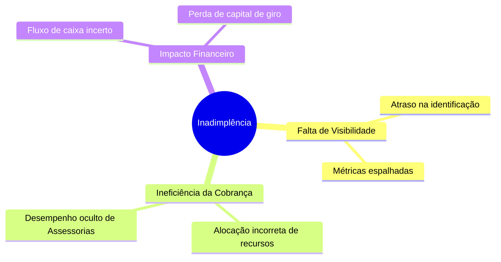

# Entrega 1 — Estruturação do Problema e Contexto Empresarial

## 1. Visão Geral do Projeto
**Projeto:** CreditGuard AI — Inteligência Analítica para Recuperação de Crédito e Prevenção de Inadimplência.
**Objetivo:** Desenvolver uma plataforma analítica centralizada para previsão de risco, gestão de carteiras críticas e otimização de estratégias de recuperação de crédito.

## 2. Divisão de Papéis da Equipe
A equipe foi estruturada simulando um ambiente real corporativo de Engenharia de Dados e Engenharia de Software:
* **Product Manager (PM) / Scrum Master:** Responsável pela definição do backlog, refinamento de requisitos e gestão do board.
* **Engenheiro de Dados:** Responsável pelo pipeline ETL dos datasets reais (`cobranca_assessorias.csv` e `fluxo_pagamentos.xlsx`), limpeza de dados (Pandas) e modelagem relacional.
* **Desenvolvedor Backend:** Responsável pela criação da API Node.js/Express, conexão com PostgreSQL, segurança (JWT) e lógica de KPIs.
* **Desenvolvedor Frontend:** Responsável pelo desenvolvimento do Dashboard Executivo em React, integração Recharts e experiência do usuário (UX).

## 3. Ambiente de Gestão do Projeto
O projeto adotou práticas ágeis adaptadas:
* **Repositório:** Versionamento de código.
* **Planejamento:** Organização de Backlog em Sprints.
* **Documentação:** Markdown mantido junto ao repositório para centralizar arquitetura e decisões de negócio.

## 4. Contexto AS-IS (Cenário Atual)
Atualmente, as assessorias de cobrança (ex: Vertice, Fenix, Nexus, Acerta) operam de forma descentralizada. 
- O recebimento de pagamentos ocorre com volumes na casa de centenas de milhares de registros (ex: 100.000 parcelas rastreadas).
- A carteira atualizada contém **10.000 contratos** gerando uma inadimplência latente de R$ 62,3 milhões.
- O time financeiro carece de ferramentas preditivas e analíticas em tempo real, limitando-se a planilhas eletrônicas obsoletas para entender a concentração do risco geográfico.

## 5. Stakeholders Envolvidos
| Stakeholder | Papel no Negócio | Necessidade Principal |
|-------------|------------------|-----------------------|
| **Diretoria Financeira** | Tomador de Decisão | Visualizar volume de capital em risco e variação mensal. |
| **Coordenador de Cobrança** | Operacional Estratégico | Identificar as assessorias com melhor taxa de acordo. |
| **Analista de Crédito** | Operacional Direto | Acessar rapidamente os clientes em estado "Crítico" (>90 dias). |

## 6. Mapa do Problema

## 7. Hipóteses Analíticas Iniciais
1. **Hipótese de Risco Regional:** Regiões com maior concentração de crédito concedido (Nordeste e Sudeste) apresentarão proporcionalmente o maior volume de inadimplência absoluta.
2. **Hipótese de Janela de Recuperação:** A maioria das recuperações (Acordos Firmados) acontece na janela entre 15 e 60 dias de atraso. Após 90 dias, a probabilidade de recuperação cai drasticamente, exigindo ações ajuizadas.
3. **Hipótese de Desempenho de Assessorias:** Existe uma variação estatística significativa na eficácia de recuperação dependendo de qual assessoria o contrato foi alocado.

---
*Gerado automaticamente pelo sistema de documentação analítica do CreditGuard AI.*
