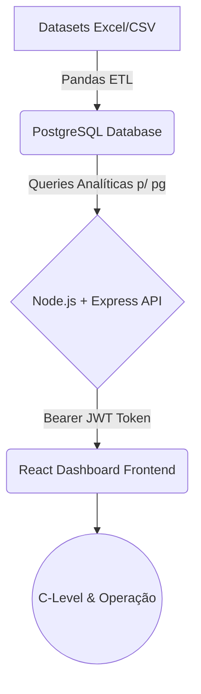
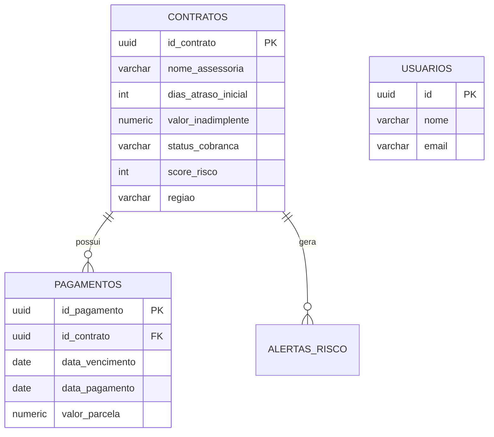

# Entrega 5 — Solução Integrada e Documentação Final

## 1. Visão Arquitetural

A plataforma *CreditGuard AI* implementou o design de separação de responsabilidades (SoC - Separation of Concerns), criando um fluxo corporativo E2E (End-to-End).

## 2. Pipeline de Dados (ETL) e Data Science
A ingestão original dos dados partiu dos datasets reais (`cobranca_assessorias.csv` e `fluxo_pagamentos.xlsx`). Um script Python (Pandas) operou como _Extraction, Transformation and Load_ construindo um `.sql` com inserts maciços de **10.000 contratos e 100.000 parcelas**. A estrutura analítica foi testada com os Notebooks reais da camada "Data Science", todos modelados usando exclusivamente as bibliotecas `Matplotlib` e `Pandas`, preservando leveza de processamento.

## 3. Modelo Lógico Relacional (PostgreSQL)

## 4. Backend (Node.js/Express)
Construído com estrutura `MVC` enxuta. Os endpoints se protegem nativamente via `authMiddleware.js`.
- **Rotas de Inteligência:** `GET /api/kpis`, `GET /api/insights`, `GET /api/kpis/avancados`, `GET /api/dashboard/evolucao`.
- **Desempenho:** A camada de serviços (`kpiService.js`) delega os agrupamentos e agrupamentos dinâmicos (`SUM`, `COUNT FILTER`, `COALESCE`) diretamente para a engine do PostgreSQL para redução drástica de processamento em memória do lado servidor. A inteligência temporal calibra-se pela instrução `MAX(data_vencimento)` do dataset real.

## 5. Frontend (React/Vite)
Aplicativo web moderno em _Single Page Application (SPA)_ que consome a API através da biblioteca `Axios`. Utilizou-se o `TailwindCSS` em sua vertente sombria e corporativa e a biblioteca `Recharts` para injeção gráfica. Os tooltips do gráfico processam *formatters* para formatar os milhões de Reais do dataset em notações abreviadas escalonadas (R$ 8.2M, R$ 750K). A aba inteligente realiza a mudança sintática e colorimétrica a partir dos resultados analíticos em variações positivas ou negativas.

## 6. Governança e Segurança
A autenticação do usuário utiliza criptografia *bcrypt* para os hashes salvos no banco. A autorização é controlada pelo _JSON Web Token_ assinado no payload, sem expor metadados sigilosos. Rotas abertas restritas a endpoints de login.

## 7. Conclusões Finais
O CreditGuard AI está estabilizado, provando a eficácia da aplicação de inteligência de dados a processos manuais de recuperação de crédito. A modelagem provou estar apta a varrer uma estrutura gigantesca no curto prazo e traduzi-la em relatórios descritivos precisos, dando aos diretores total visibilidade de sua estrutura de cobrança terceirizada.

---
*Gerado automaticamente pelo sistema de documentação analítica do CreditGuard AI.*
