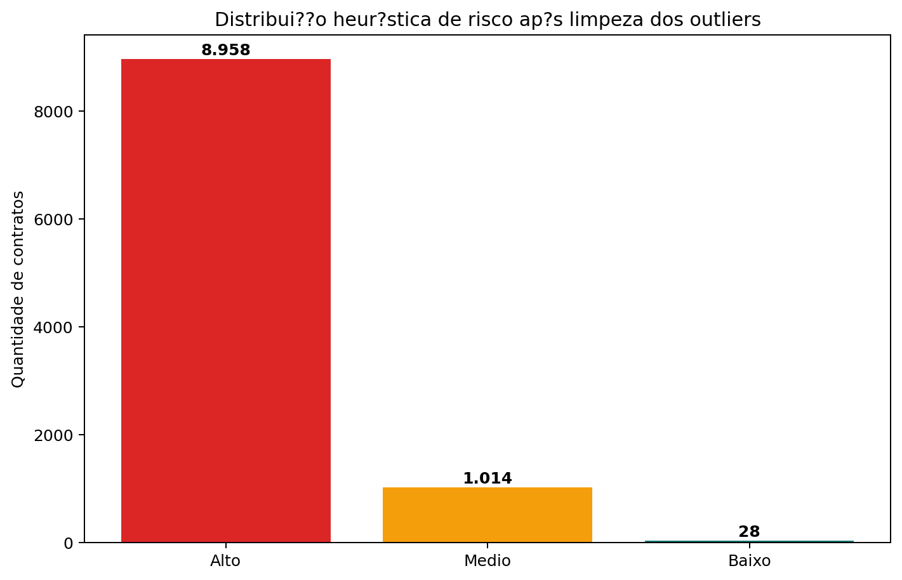
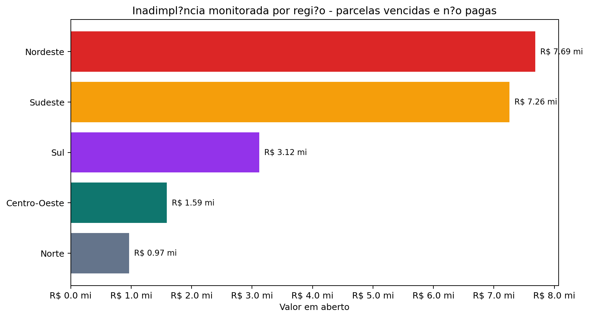
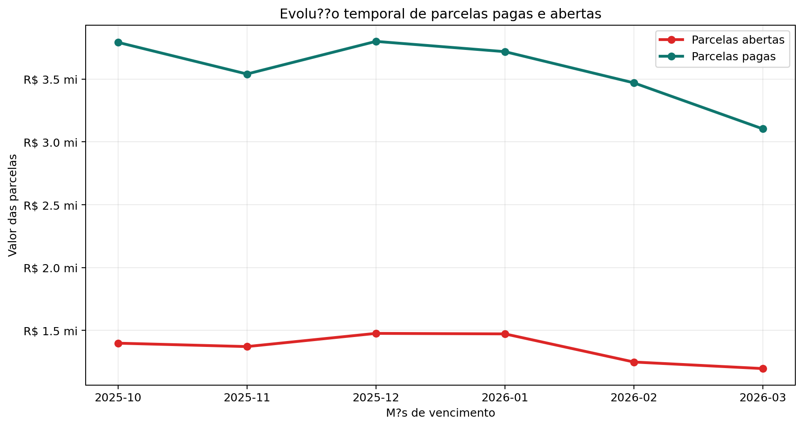
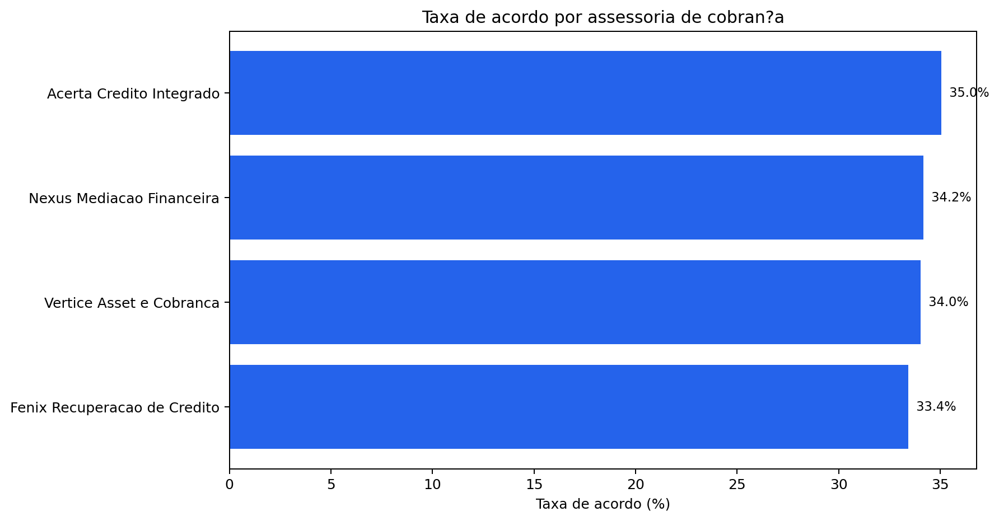
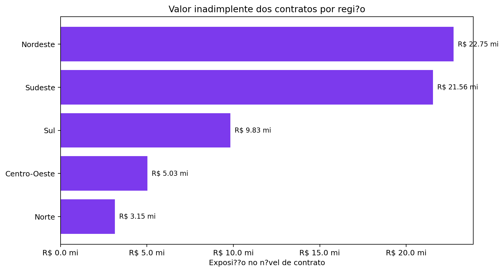

# Entrega 5 - Solução Integrada

## 1. Introdução

O CreditGuard AI foi desenvolvido como uma solução integrada para apoiar processos de recuperação de crédito, monitoramento da inadimplência e análise operacional de contratos financeiros. A solução conecta Ciência de Dados, banco de dados, backend, segurança, APIs e dashboard executivo em um fluxo único.

O projeto utiliza dados reais provenientes dos arquivos:

- `data-science/cobranca_assessorias.csv`: 10.000 contratos financeiros.
- `data-science/fluxo_pagamentos.xlsx`: 100.000 registros de pagamentos.

Esses dados são processados por Python/Pandas, armazenados em PostgreSQL, disponibilizados por APIs REST em Node.js/Express e consumidos por um frontend React. A arquitetura permite transformar dados financeiros brutos em KPIs, alertas, gráficos e insights para Diretoria, Financeiro e Operação de Cobrança.

O sistema não utiliza modelo preditivo de Machine Learning. A classificação de risco é baseada em regras heurísticas transparentes, construídas a partir de atraso, status de cobrança e score interno de risco.

## 2. Arquitetura Técnica e Topologia da Solução

A solução foi construída com arquitetura modular, separando responsabilidades entre processamento analítico, persistência, APIs, autenticação e visualização.

Fluxo principal:

```text
Python/Pandas -> PostgreSQL -> Node.js/Express -> React Dashboard
```

Topologia geral:

```text
Datasets CSV/XLSX
      |
      v
Pipeline ETL em Python
      |
      v
Arquivos limpos e seed_real.sql
      |
      v
PostgreSQL / Supabase
      |
      v
API REST Node.js + Express
      |
      v
Frontend React + Recharts
```

### Componentes da Arquitetura

| Componente | Tecnologia | Responsabilidade |
|---|---|---|
| Ciência de Dados | Python, Pandas, Jupyter | Limpeza, EDA, KPIs, regras heurísticas e gráficos |
| Banco de Dados | PostgreSQL | Persistência relacional e consultas analíticas |
| Backend | Node.js, Express | APIs REST, autenticação, KPIs e insights |
| Segurança | JWT, bcrypt | Proteção de credenciais e rotas |
| Frontend | React, Vite, TailwindCSS | Dashboard executivo e telas operacionais |
| Visualização | Recharts, Matplotlib | Gráficos interativos e figuras analíticas |

## 3. Fluxo de Dados e Processos do Sistema

O funcionamento do sistema começa com a ingestão dos datasets financeiros e termina na visualização dos indicadores no dashboard.

### 3.1 Ingestão

O pipeline lê os arquivos originais:

```python
contratos = pd.read_csv(cobranca_path, encoding='latin1')
pagamentos = pd.read_excel(pagamentos_path)
```

Volume processado:

- Contratos: `10.000`.
- Pagamentos: `100.000`.

### 3.2 Transformação

Durante o ETL, são executadas as seguintes etapas:

- Tratamento de encoding.
- Padronização de assessorias.
- Padronização de regiões.
- Conversão de valores monetários.
- Conversão de datas.
- Imputação de scores nulos pela mediana.
- Remoção/verificação de duplicatas.
- Tratamento de outliers.
- Classificação heurística de risco.
- Geração de alertas automáticos.

O tratamento mais importante foi aplicado ao campo de atraso. Foram identificados **80 outliers**:

- 50 registros com `-999 dias`.
- 30 registros com `9999 dias`.

Esses valores foram substituídos pela mediana válida de **89 dias**, mantendo todos os 10.000 contratos na base e eliminando distorções nos KPIs.

### 3.3 Carga

Após o tratamento, o pipeline gera:

- `data-science/notebooks/contratos_clean.csv`.
- `data-science/notebooks/pagamentos_clean.csv`.
- `database/seed_real.sql`.

O `seed_real.sql` carrega no PostgreSQL:

- 10.000 contratos.
- 100.000 pagamentos.
- 9.987 alertas.
- 0 outliers de atraso.

## 4. Desenho das Automações Propostas

A solução automatiza tarefas que antes dependeriam de análise manual.

### 4.1 Automação do ETL

O script `etl_real.py` executa:

- Leitura dos datasets.
- Limpeza dos dados.
- Tratamento de nulos e outliers.
- Geração de arquivos limpos.
- Geração do seed SQL.

### 4.2 Automação dos KPIs

O backend calcula KPIs diretamente por SQL. Os principais indicadores são:

| KPI | Valor Atual |
|---|---:|
| Valor inadimplente dos contratos | R$ 62.308.840,80 |
| Inadimplência monitorada | R$ 20.621.400,00 |
| Recuperação no mês | R$ 1.431.904,74 |
| Taxa de recuperação | 25,50% |
| Atraso médio inicial | 89,65 dias |
| Aging operacional | 223,86 dias |
| Clientes críticos | 8.958 |
| Alertas automáticos | 9.987 |

### 4.3 Automação da Classificação de Risco

A classificação utiliza regras heurísticas:

| Nível | Critério |
|---|---|
| Alto | Atraso inicial maior que 60 dias, status ajuizado ou score acima de 70 |
| Médio | Atraso entre 16 e 60 dias ou status de insucesso |
| Baixo | Atraso até 15 dias e ausência de indicadores críticos |

Distribuição final:

| Risco | Contratos |
|---|---:|
| Alto | 8.958 |
| Médio | 1.014 |
| Baixo | 28 |



### 4.4 Automação de Insights

O backend gera insights textuais a partir de consultas agregadas:

- Região com maior concentração de inadimplência.
- Assessoria com maior taxa de acordo.
- Quantidade de contratos em aberto.
- Contratos com atraso superior a 90 dias.
- Ticket médio regional.

Esses insights são exibidos na Central de Inteligência Analítica.

## 5. Modelo Lógico de Banco de Dados

O PostgreSQL foi estruturado para integrar contratos, pagamentos, usuários e alertas de risco.

### 5.1 Tabela `contratos`

Armazena os dados principais de cada contrato:

- Identificador do contrato.
- Assessoria responsável.
- Data de envio.
- Dias de atraso inicial.
- Valor inadimplente.
- Status de cobrança.
- Score de risco.
- Região.

### 5.2 Tabela `pagamentos`

Armazena o histórico de parcelas:

- Identificador do pagamento.
- Contrato relacionado.
- Número da parcela.
- Data de vencimento.
- Data de pagamento.
- Valor da parcela.
- Valor pago.
- Forma de pagamento.
- Indicador de contemplação.

### 5.3 Tabela `alertas_risco`

Armazena os alertas automáticos gerados pelo motor heurístico:

- Identificador do alerta.
- Contrato relacionado.
- Nível de risco.
- Descrição do alerta.
- Data de criação.

### 5.4 Tabela `usuarios`

Armazena usuários autorizados:

- Nome.
- E-mail.
- Hash da senha.
- Data de criação.

### 5.5 Relacionamentos

```text
contratos 1:N pagamentos
contratos 1:N alertas_risco
usuarios 1:N sessões autenticadas por JWT
```

Essa modelagem permite preservar integridade entre contratos e pagamentos, além de sustentar consultas agregadas utilizadas pelo dashboard.

## 6. Estratégia de Integrações

### 6.1 Integração Ciência de Dados -> Banco

O pipeline de dados gera `seed_real.sql`, que é executado no PostgreSQL. Essa estratégia garante reprodutibilidade da carga e facilita auditoria dos dados.

### 6.2 Integração Banco -> Backend

O backend utiliza o pacote `pg` para se conectar ao PostgreSQL. As consultas analíticas ficam centralizadas em `kpiService.js`, com uso de:

- `SUM()`.
- `COUNT()`.
- `AVG()`.
- `GROUP BY`.
- `COALESCE()`.
- Filtros por data de vencimento e pagamento.

### 6.3 Integração Backend -> Frontend

O frontend consome as APIs por Axios. Os principais endpoints são:

| Endpoint | Finalidade |
|---|---|
| `POST /api/login` | Autenticação |
| `GET /api/kpis` | KPIs principais |
| `GET /api/kpis/avancados` | KPIs derivativos |
| `GET /api/insights` | Insights automáticos |
| `GET /api/dashboard/evolucao` | Evolução temporal |
| `GET /api/dashboard/risco-regional` | Inadimplência por região |
| `GET /api/clientes` | Contratos paginados |
| `GET /api/clientes/:id` | Detalhe de contrato |
| `GET /api/alertas` | Alertas de risco |

### 6.4 Integração com Sistemas Legados

No escopo acadêmico, a integração com sistemas legados foi representada pela ingestão de arquivos CSV/XLSX. Em um ambiente corporativo real, essa mesma arquitetura poderia ser adaptada para:

- APIs de core bancário.
- Exportações periódicas de ERP.
- Rotinas de SFTP.
- Filas de mensageria.
- Cargas agendadas em lote.

## 7. Frontend e Dashboard Executivo

O frontend foi desenvolvido com React e Vite, utilizando Recharts para gráficos e TailwindCSS para estilização.

Telas implementadas:

1. Dashboard Executivo.
2. Portfólio de Contratos.
3. Detalhe de Contrato.
4. Central de Alertas.
5. Inteligência Analítica.
6. Login.

### Figura 2 - Inadimplência Monitorada por Região



Essa visualização alimenta a análise regional do dashboard, mostrando a concentração operacional das parcelas vencidas e não pagas.

### Figura 3 - Evolução Temporal



Essa visualização sustenta a curva de tendência temporal, requisito da Entrega 4 e parte da solução integrada.

### Figura 4 - Performance das Assessorias



Essa análise apoia decisões operacionais sobre redistribuição de carteira e acompanhamento de produtividade.

## 8. Mecanismos de Segurança da Informação

A segurança da aplicação foi implementada em múltiplas camadas.

### 8.1 Autenticação

O login valida e-mail e senha no backend. Após autenticação, o sistema emite um token JWT.

### 8.2 Proteção de Senhas

As senhas são armazenadas com bcrypt, evitando armazenamento em texto puro.

### 8.3 Rotas Protegidas

As rotas analíticas exigem token JWT válido. Sem autenticação, o usuário não acessa KPIs, contratos, alertas ou insights.

### 8.4 Controle de Acesso no Frontend

O frontend protege rotas internas e redireciona usuários não autenticados para a tela de login.

### 8.5 Dados Sensíveis

Por se tratar de dados financeiros, o sistema centraliza acesso pelo backend e evita exposição direta do banco ao frontend.

## 9. Modelo de Governança de Dados

A governança da solução foi baseada em consistência, rastreabilidade e padronização.

### 9.1 Consistência Analítica

Foi definido um dicionário de KPIs para evitar ambiguidades:

- R$ 62,3 milhões: exposição no nível de contrato.
- R$ 20,6 milhões: parcelas vencidas e não pagas monitoradas pelo dashboard.

### 9.2 Qualidade de Dados

O ETL trata:

- Dados nulos.
- Outliers.
- Formatos monetários.
- Datas.
- Padronização textual.

### 9.3 Rastreabilidade

Os notebooks documentam a análise, enquanto o `etl_real.py` gera os artefatos operacionais. Isso permite reproduzir os resultados e auditar a origem dos números.

### 9.4 Transparência das Regras

As regras heurísticas são simples e explicáveis. Cada classificação de risco pode ser justificada por atraso, status ou score.

## 10. Resultados Obtidos

A solução implementada permitiu:

- Centralizar dados de 10.000 contratos e 100.000 pagamentos.
- Eliminar 80 outliers de atraso da base operacional.
- Gerar 9.987 alertas automáticos.
- Identificar 8.958 contratos classificados como risco alto.
- Monitorar R$ 20.621.400,00 em parcelas vencidas e não pagas.
- Mapear R$ 62.308.840,80 de exposição no nível de contrato.
- Calcular recuperação mensal de R$ 1.431.904,74.
- Exibir risco regional, tendência temporal e insights automáticos.

### Figura 5 - Exposição dos Contratos por Região



A figura mostra a exposição financeira no nível de contrato, complementando a visão operacional de parcelas vencidas.

## 11. Validação Técnica

Foram executadas validações para confirmar o funcionamento integrado:

- Pipeline ETL executado com sucesso.
- Notebooks executados com sucesso.
- Banco PostgreSQL carregado com 10.000 contratos e 100.000 pagamentos.
- Outliers de atraso no banco: 0.
- Frontend compilado com `npm run build`.
- Lint do frontend aprovado com `npm run lint`.
- Teste de smoke do backend aprovado com `npm test`.

## 12. Conclusão

A Entrega 5 consolida a solução integrada do CreditGuard AI. A arquitetura conecta Ciência de Dados, PostgreSQL, backend Node.js/Express, autenticação JWT e frontend React em uma plataforma funcional de recuperação de crédito e inteligência analítica.

Os componentes obrigatórios foram atendidos:

- Arquitetura técnica e topologia da solução.
- Fluxo de dados e processos do sistema.
- Desenho das automações propostas.
- Modelo lógico de banco de dados.
- Estratégia de integrações por APIs e arquivos legados.
- Mecanismos de segurança da informação.
- Modelo de governança de dados.

A solução entrega uma visão gerencial e operacional consistente, com dados reais, KPIs padronizados, alertas automáticos e insights acionáveis para apoiar a tomada de decisão em recuperação de crédito.
